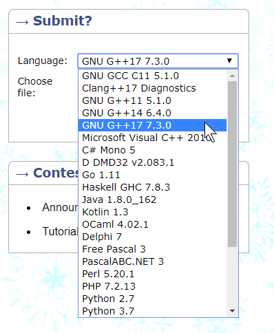

# CodeForces C++
> Check out my [blog](https://codebarn.ca) for more stuff like this
<span>
    <a href="https://codebarn.ca"></a>
</span>

## Overview

This repository is for CodeForces problem solutions, written in C++.  Also included are a handful of useful data structures, algorithms, and various implementations I've written over the years.

## Getting started

Most C++ programs you'll find in this repository are standalone, single-file.  Most competitive programming contests and sites offer GNU GCC, so that's generally what we want to build with.  C++11 was/is considered very standard, but most contests and online judging systems also allow for C++14 or even C++17; no that there is a huge difference in features.  But you *always* want to use the same compiler as the judging system you'll be submitting against, so don't just fire up your Visual Studio IDE without a second thought.  Problems are meant to be solved in a contest-setting, which means (ideally) your code is relatively short, and certainly a single source file.   Most people opt for a lighter editor like [Emacs](https://www.gnu.org/software/emacs/), [Vim](https://www.vim.org/), or even [VS Code](https://code.visualstudio.com/).

### Compile / debugging

Compilation is almost always the same (see below), and you run your executable with input being piped in from a file, e.g. `./solution.exe < input.txt`, and output to standard out (redirect to file with `./solution.exe < input.txt > output.txt`).

On Windows, I enjoy using [MSYS2](http://www.msys2.org/) since you get `pacman`.  But you can also try [Cygwin](https://www.cygwin.com/), or you can download [MinGW-64](https://mingw-w64.org) and use a MinTTY emulator like [Git-bash](https://gitforwindows.org/).  On Linux, just use whatever you have, as `GCC` is pretty universally accessible (on new setups of say, Ubuntu for example, you may need to run `sudo apt-get install build-essential`).

Once you're all setup, with your solution contained in a single C++ source file like `main.cc` file ready to go, compile with:

```shell
g++ -std=c++17 -Wall main.cc -o main.exe
```

### Submission (CodeForces)

Lets say you are solving problem `1102E` on CodeForces ([here](https://codeforces.com/problemset/problem/1102/E)).  You want to submit.  From the problem page, on the side bar *select the language* and compiler:



## Links

### Online judges

- CodeForces: https://codeforces.com/, [Code drills](https://code-drills.com), [CodeForces Visualizer](https://cfviz.netlify.com/)
- UVa Online Judge: https://uva.onlinejudge.org/, [uHunt](https://uhunt.onlinejudge.org/), [Live Archive](https://icpcarchive.ecs.baylor.edu/)
- Kattis: https://www.kattis.com/


### Learning

- GeeksforGeeks: https://www.geeksforgeeks.org/
- C++17 Features: https://medium.com/@afinlay/new-language-features-language-changes-in-c-17-7e953ff64c65
- C++17, competitive programming edition: https://codeforces.com/blog/entry/57729
- Graph Algorithms: https://codeforces.com/blog/entry/16221?locale=en
- Everything about dynamic programming: https://codeforces.com/topic/43366/en4
- Awesome Competitive Programming: http://codeforces.com/blog/entry/23054


<!-- Even though this information can be found inside the project on machine-readable
format like in a .json file, it's good to include a summary of most useful
links to humans using your project. You can include links like:

- Project homepage: https://your.github.com/awesome-project/
- Repository: https://github.com/your/awesome-project/
- Issue tracker: https://github.com/your/awesome-project/issues
  - In case of sensitive bugs like security vulnerabilities, please contact
    my@email.com directly instead of using issue tracker. We value your effort
    to improve the security and privacy of this project!
- Related projects:
  - Your other project: https://github.com/your/other-project/
  - Someone else's project: https://github.com/someones/awesome-project/ -->


## Licensing

The code in this project is licensed under MIT license.

```
The MIT License (MIT)

Copyright (c) 2019 C. Barnson

Permission is hereby granted, free of charge, to any person obtaining a
copy of this software and associated documentation files (the "Software"),
to deal in the Software without restriction, including without limitation
the rights to use, copy, modify, merge, publish, distribute, sublicense,
and/or sell copies of the Software, and to permit persons to whom the
Software is furnished to do so, subject to the following conditions:

The above copyright notice and this permission notice shall be included in
all copies or substantial portions of the Software.

THE SOFTWARE IS PROVIDED "AS IS", WITHOUT WARRANTY OF ANY KIND, EXPRESS
OR IMPLIED, INCLUDING BUT NOT LIMITED TO THE WARRANTIES OF MERCHANTABILITY,
FITNESS FOR A PARTICULAR PURPOSE AND NONINFRINGEMENT. IN NO EVENT SHALL THE
AUTHORS OR COPYRIGHT HOLDERS BE LIABLE FOR ANY CLAIM, DAMAGES OR OTHER
LIABILITY, WHETHER IN AN ACTION OF CONTRACT, TORT OR OTHERWISE, ARISING
FROM, OUT OF OR IN CONNECTION WITH THE SOFTWARE OR THE USE OR OTHER
DEALINGS IN THE SOFTWARE.
```